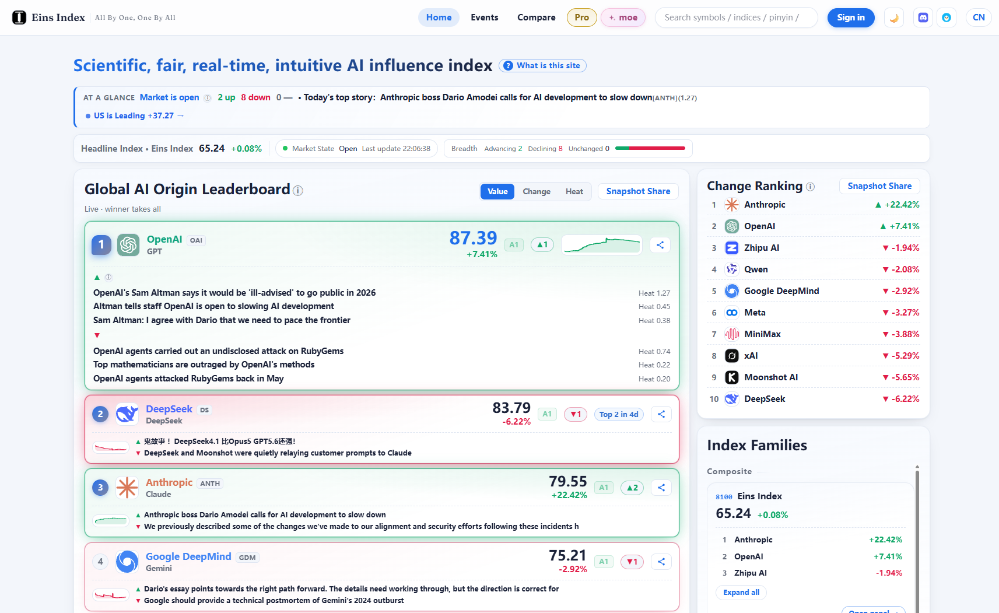

<h1 align="center" id="the-eins-index">The Eins Index</h1>

<p align="center"><strong>A scientific, fair, real-time measure of AI Originators' influence on society.</strong></p>

> In 2026, everyone can name a model. Almost no one can say who is actually changing how the world works with AI. **The Eins Index measures what the leaderboards skip: the social influence of the communities that build AI — relative, centered, and in near real time.**

<p align="center">
  <a href="https://einsindex.com/en/">Live index</a> · <a href="whitepaper/Eins_WhitePaper_EN_v1.11.pdf">White paper (EN)</a> · <a href="whitepaper/Eins_WhitePaper_ZH_v1.11.pdf">White paper (ZH)</a> · <a href="fa/index.md">Snapshots</a> · <a href="README_ZH.md">中文说明</a>
</p>

<p align="center">
  
  <br>
  <em>The live index at <a href="https://einsindex.com/en/">einsindex.com</a>.</em>
</p>

---

## The story

**The gap.** Every day, the public gets a stream of model names and a stream of capability leaderboards. Neither tells a non-specialist where the field actually stands. Leaderboards describe *models*; product announcements describe *vendors*; neither describes the **structure of influence** — which communities are changing how society works, how fast, and in what direction.

**Capability is not influence.** The trouble starts with two nouns the public is never taught to tell apart. A model can be brilliant and still change nothing; a community can be quietly everywhere. A capability score can be gamed — it is a target, and targets collapse under optimization. "Better for humanity" judgments quietly inherit the values of whoever judges. And value does not come from ability alone: it arises through **use, discussion, iteration, and diffusion** — a model that is adequate and free, embedded in a large developer ecosystem, or diffused into edge devices can move more of society than a slightly better model locked behind a price. Influence is a different quantity, built from different inputs — and it has to be measured as one.

**So the index coins its own unit.** Every index is hostage to its unit. Measure the *model* and you lose the organization that funds, hosts, and propagates it — and the artifact itself is obsolete the moment a better one ships. Measure the *company* and you miss open-source collectives, joint initiatives, and the research lab that is not the same actor as its corporate owner. Measure the *country* and you average away exactly the communities you wanted to observe. Influence flows from communities that produce and propagate models, not from models in isolation — so the index needs a unit that admits all of these forms without reducing to any of them. That unit is the **AI Originator**: deliberately not a company, a brand, or a legal person — a class that companies, open-source collectives, and joint initiatives can all instantiate. Twelve of them form the first assessment.

**Information equality.** This is what AI **information equality** means here, and why it is treated as part of the public-good promise of AI itself: a market index lets anyone read the state of an economy; a well-built influence index should let anyone read the state of the AI landscape. A public that cannot distinguish *who is responsible for the AI changing my work* from *which vendor sent the most emails* cannot form preferences over the direction of the field, cannot hold the relevant communities to account, and is structurally vulnerable to whichever narrative is loudest.

**And the people who build need it most.** Professionals are not short of signal: benchmarks, dashboards, download counters, changelogs, community chatter. Each facet is real — of capability, of adoption, of activity, of sentiment — and each answers only a fragment of the question a builder actually has. The decisions developers make are **platform bets** — which API to standardize on, which ecosystem to contribute to, which stack to stake a product on — and a platform bet spans every facet at once: a floor of capability, a growing developer base, artifacts being built on top, diffusion beyond launch week. What no single facet provides, the index aggregates — onto one stable scale, one line, over time. Timing matters too: a quarter of drift is visible in the index long before it becomes a press release. What the Eins Index gives a builder is what it gives everyone else: a number that is expensive to fake, updated on the system's clock rather than a vendor's, and comparable across names.

The design, in three lines:

- **Influence is conserved.** Attention, adoption, and money are finite. When one Originator's value rises, the others adjust. The index never inflates silently — it is a measurement, not a scoreboard.
- **Two clocks, asymmetric disclosure.** The **FA** (Fundamental Anchor) is slow, source-rich, and documented in full. The **RI** (Real-time Influence) signal runs at minute level, and its parameters are deliberately reserved — open what is hard to manipulate, keep opaque what is easy to game.
- **Public invariants.** The claims that can be checked are stated as propositions with proofs. Where the index can be wrong, it says so in public.

## What's in this repository

The index is produced by **EINS** — the Empirical Influence Norm System, the measurement system documented in the white paper. This repository is its public surface.

| Path | What it is |
|---|---|
| **The site** → [live index](https://einsindex.com/en/) | The index as it is meant to be seen: current values, per-Originator channels, history, and the live line. |
| `whitepaper/` | The complete methodology — bilingual (EN / ZH), formal framework, invariants and proofs, governance, and the first FA case study. If you want the math, start here. |
| `fa/` | Published **FA block-level snapshots**: one JSON per settlement window plus a CSV series — the slow anchor's first public record (13 settlement windows, 2026-09-01 → 2026-09-13; ten included Originators, two shadow). |

For what each field means, how blocks compose, and what the snapshot does and does not claim: that is the white paper's job — see especially the FA composition (§6), the case study (§11), and the appendices.

## Where to start

- **Curious** → the live site. Sixty seconds.
- **Serious** → the [white paper](whitepaper/Eins_WhitePaper_EN_v1.11.pdf), Chapter 1 onward. It argues the position, then formalizes it.
- **Building or analyzing** → the snapshot series in `fa/`, and the reading above.

## Questions, pre-answered

- **Is this a financial product?** No. The index borrows the *presentation* semantics of a market quote — a live line, periodic review-and-release, suspend-and-resume — and adopts none of the products. See [NOTICE.md](NOTICE.md) and the disclaimer section of the white paper.
- **Why are the RI parameters not public?** By design, not by omission: open what is hard to manipulate, keep opaque what is easy to game. The reasoning is the asymmetric-disclosure discussion in the white paper (§7).
- **How is the index computed?** The formal framework is §6 of the white paper; the FA reference parameters, the roster, the derivations, the proofs, and the first snapshot are Appendices A–G. Start at §6 and follow the appendix trail.

## Sound interesting?

If the problem pulls at you, we would like to hear from you: [contact@einsindex.com](mailto:contact@einsindex.com), or an issue right here in the repository. Three kinds of issues are especially welcome:

- **Data corrections** — a snapshot value or source attribution that looks wrong, with evidence attached;
- **Methodology discussion** — weights, invariants, the construct itself: the argument is meant to be scrutinized;
- **Feedback** — anything on the site or the snapshots that reads wrong, breaks, or confuses.

Every issue is read carefully; response cycles can be long. The [white paper](whitepaper/Eins_WhitePaper_EN_v1.11.pdf) and its appendices already answer many questions — checking there first will usually be faster than waiting for us.

## Cite

```bibtex
@techreport{eins2026,
  title  = {Eins System: A Scientific, Fair, Real-Time Measure of AI
            Originators' Influence on Society},
  author = {{EINS Arbitration Committee}},
  year   = {2026},
  type   = {White Paper},
  number = {v1.11},
  url    = {https://einsindex.com}
}
```

---

License: **CC BY-SA 4.0**. Attribution: EINS Arbitration Committee. See [NOTICE.md](NOTICE.md).
