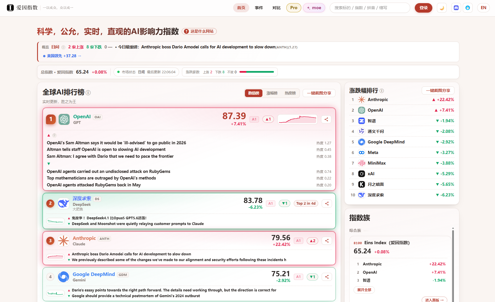

<h1 align="center" id="eins-指数">Eins 指数</h1>

<p align="center"><strong>科学、公平、实时——测量 AI 智原对社会的影响力。</strong></p>

> 2026 年，人人都能说出几个模型的名字。却几乎没有人说得出，究竟是谁在用 AI 改变世界的运转方式。**Eins 指数测量的是排行榜跳过的那件事：创造 AI 的社群的社会影响力——相对、居中、近乎实时。**

<p align="center">
  <a href="https://einsindex.com/cn/">在线指数</a> · <a href="whitepaper/Eins_WhitePaper_ZH_v1.11.pdf">白皮书（中文）</a> · <a href="whitepaper/Eins_WhitePaper_EN_v1.11.pdf">白皮书（英文）</a> · <a href="fa/index_ZH.md">快照数据</a> · <a href="README.md">English</a>
</p>

<p align="center">
  
  <br>
  <em>在线指数：<a href="https://einsindex.com/cn/">einsindex.com</a>（中文版）。</em>
</p>

---

## 这个故事

**鸿沟**。每天，公众面对的是一串模型的名字，和一串标榜「能力」的排行榜。没有一样能告诉一个非专业者：这个领域究竟处于什么状态。排行榜描述的是*模型*；发布会描述的是*厂商*；两者都不描述**影响力的结构**——哪些社群在改变社会的运转方式、多快、朝什么方向。

**能力不是影响力**。麻烦始于两个公众从未被教会区分的名词。一个模型可以才华横溢却什么都没有改变；一个社群可以安静地无处不在。能力分数可以被操纵——它是一个靶子，而靶子在优化下必然失真。「对人类更好」的评判会悄悄继承评判者自己的价值观。而且价值并不只来自能力：它经由**使用、讨论、迭代与扩散**产生——一个足够好且免费的模型、一个嵌入庞大开发者生态的模型、一个扩散进边缘设备的模型，可以比一个稍强但锁在付费墙后的模型撬动更多社会。影响力是另一个量，由不同的输入构成——它必须作为另一个量被测量。

**所以指数发明了自己的单位**。每个指数都受制于它的测量单位。测*模型*，你就丢掉了资助、承载并传播它的组织——而且工件本身在更好的版本发布那一刻就过时了。测*公司*，你就漏掉了开源社群、联合计划，以及与其母公司并不同一的研究实验室。测*国家*，你恰恰把想观察的社群平均掉了。影响力从生产并传播模型的社群流出，而不是从孤立的模型流出——所以指数需要一个能容纳所有这些形态、又不还原为其中任何一种的单位。这个单位就是 **AI 智原**：刻意不作为公司、品牌或法人——一个公司、开源社群、联合计划都能实例化的类。首次评估共十二个。

**信息平权**。这正是此处所说的 AI **信息平权**，也是它被当作 AI 公共产品承诺一部分的原因：市场指数让任何人都能读懂一个经济体的状态；一个建造良好的影响力指数，应该让任何人都能读懂 AI 版图的状态。一个分不清「谁在为我生活中被改变的 AI 负责」和「哪家厂商给我发了最多邮件」的公众，无法对领域的方向形成偏好，无法问责该被问责的社群，并且在结构上只能被声音最大的叙事裹挟。

**而建造者恰恰是最需要它的人**。专业开发者从不缺信号：基准测试、仪表盘、下载量、更新日志、社区讨论。每一个侧面都真实——能力的一个侧面、采纳的一个侧面、活跃度的一个侧面、情绪的一个侧面——但每一个都只回答了建造者真正那个问题的一小块。开发者做出的决策是**平台押注**——把哪套 API 变成标准、向哪个生态贡献、把产品押在哪个技术栈上——而平台押注同时跨过所有侧面：一条能力底线、一个在增长的开发者群体、正在被构建的上层工件、发布周之外的持续扩散。任何单一侧面提供不了的聚合，正是指数所提供的——在同一把稳定尺子上，汇成一条随时间的线。时机也重要：一个季度的漂移，在指数里远早于它变成新闻稿之前就可见。Eins 指数给建造者的，和给所有人的一样：一个难以伪造的数字，按系统的时钟而非厂商的时钟更新，跨名字可比。

设计，三行说完：

- **影响力是守恒的**。注意力、采纳与资金都是有限的。当一个智原的值上升，其余随之调整。指数不会悄悄膨胀——它是测量，不是记分板。
- **两个时钟，非对称披露**。**FA**（基本面锚）缓慢、来源丰富、完整成文；**RI**（实时影响力）信号按分钟运行，参数刻意保留——开放难以操纵的，保留易于操纵的。
- **公开的不变量**。可被检验的主张以带证明的命题陈述。指数可能在何处出错，它就当众说在哪里。

## 本仓内容

指数由 **EINS**（Empirical Influence Norm System，经验影响力规范系统）产出——白皮书所记录的测量系统。本仓库是它的公开界面。

| 路径 | 内容 |
|---|---|
| **站点** → [在线指数](https://einsindex.com/cn/) | 指数本来的样子：当前值、逐智原通道、历史与实时线。 |
| `whitepaper/` | 完整方法论——双语（中/英）、形式化框架、不变量与证明、治理，以及首次 FA 案例研究。想看数学，从这里开始。 |
| `fa/` | 已发布的 **FA 分块快照**：每个结算窗一份 JSON，外加 CSV 序列——基本面锚的首份公开记录（13 个结算窗，2026-09-01 → 2026-09-13；十个纳入智原，两个影子）。 |

每个字段的含义、分块如何合成、快照主张与不主张什么——这是白皮书的职责：重点见 FA 构成（§6）、案例研究（§11）与附录。

## 从哪里开始

- **好奇** → 在线站点，六十秒。
- **认真** → [白皮书](whitepaper/Eins_WhitePaper_ZH_v1.11.pdf)，从第 1 章读起。它先论证立场，再形式化它。
- **做数据** → `fa/` 的快照序列，以及上面的阅读路径。

## 先答为敬

- **这是金融产品吗**？不是。指数借用的是行情的*呈现*语义——实时线、定期评审与发布、暂停与恢复——而不采用任何金融产品本身。见 [NOTICE.md](NOTICE.md) 与白皮书免责声明一节。
- **RI 参数为什么不公开**？按设计，而非遗漏：开放难以操纵的，保留易于操纵的。论证见白皮书非对称披露一节（第 7 章）。
- **指数是怎么算出来的**？形式化框架在白皮书第 6 章；FA 参考参数、名册、推导、证明与首次快照在附录 A–G。从第 6 章读起，沿附录一路跟下去。

## 感兴趣？

如果这个问题让你有兴趣，欢迎联系 [contact@einsindex.com](mailto:contact@einsindex.com)，或直接在本仓提 issue。三类 issue 尤其欢迎：

- **数据勘误**——某个快照值或来源归属看起来不对，请附上证据；
- **方法论讨论**——权重、不变量、构念本身：这套论证本来就是要被审视的；
- **反馈**——站点或快照上任何读起来不对、坏了、令人困惑的地方。

每个 issue 都会被认真阅读；回复周期可能较长。[白皮书](whitepaper/Eins_WhitePaper_ZH_v1.11.pdf)及其附录已经回答了许多问题——先查白皮书，通常比等我们更快。

## 引用

```bibtex
@techreport{eins2026,
  title  = {Eins System: A Scientific, Fair, Real-Time Measure of AI
            Originators' Influence on Society},
  author = {{EINS Arbitration Committee}},
  year   = {2026},
  type   = {White Paper},
  number = {v1.11},
  url    = {https://einsindex.com}
}
```

---

许可：**CC BY-SA 4.0**。署名：EINS 仲裁委员会。见 [NOTICE.md](NOTICE.md)。
